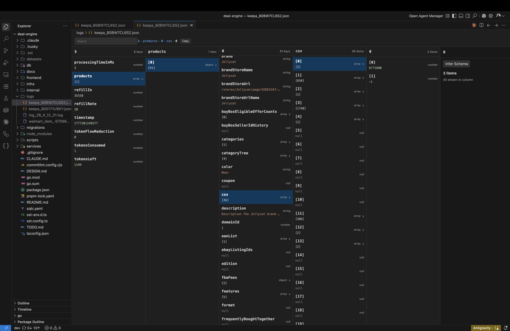
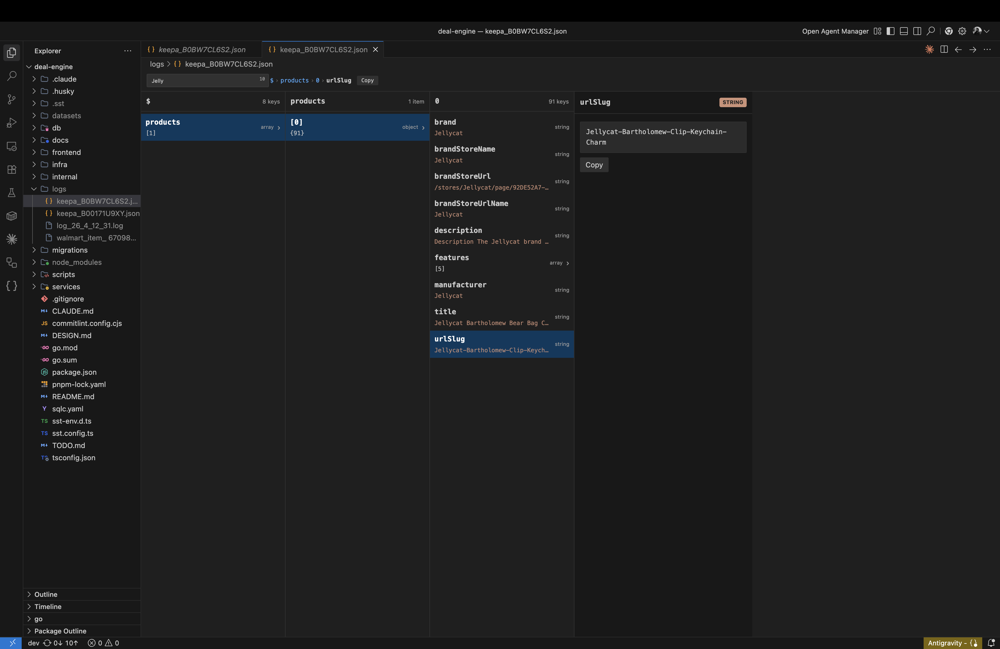

# JsonLens

**Interactive JSON navigation and analysis for modern IDEs.**

JsonLens provides an interactive, visual interface for exploring, searching, and analyzing JSON files. It brings powerful visualization tools directly into your favorite editor, whether you're using VS Code, Antigravity, Cursor, or VSCodium.

## Features

- **Finder-style Column Browser:** Navigate through complex JSON structures using a familiar column-based interface.
- **Field Analysis:** Quickly analyze array fields to get statistical insights, type distributions, and common values.

- **Schema Inference:** Automatically infer JSON Schema from your data and export it for use in other tools.
- **High Performance:** Uses streaming parsers to handle large JSON files efficiently without freezing the editor.
- **Bi-directional Sync:** Clicking a node in the visual preview highlights it in the text editor, and moving your cursor in the text editor updates the visual preview.
- **Search:** Instant search across the entire JSON tree.
- **Breadcrumb Navigation:** Always know where you are with a clear path trail.

## Getting Started

### Opening JsonLens

There are several ways to open the JsonLens preview:

1.  **Context Menu:** Right-click a `.json` or `.jsonc` file in the Explorer or Editor and select **"JsonLens: Open Preview"**.
2.  **Keybinding:** Press `Cmd+Alt+J` (macOS) or `Ctrl+Alt+J` (Windows/Linux) while an editor with a JSON file is active.
3.  **Command Palette:** Open the Command Palette (`Cmd+Shift+P` or `Ctrl+Shift+P`) and search for **"JsonLens: Open Preview"**.
4.  **Activity Bar:** Click the JsonLens icon in the Activity Bar to see a list of open editors and recent JSON files.

## Configuration

You can customize JsonLens behavior in your VS Code settings:

- `jsonlens.largeFileThresholdMB`: Threshold (in MB) above which files use streaming parse (default: `2`).
- `jsonlens.veryLargeFileThresholdMB`: Threshold (in MB) for top-level-only streaming on extremely large files (default: `20`).
- `jsonlens.maxChildrenPerNode`: Maximum number of children rendered per node before pagination kicks in (default: `200`).
- `jsonlens.debug`: Enable debug output channel with timing logs.

## Commands

The following commands are available in the Command Palette (`Cmd+Shift+P` or `Ctrl+Shift+P`):

- `JsonLens: Open Preview` - Opens the interactive visual preview for the currently active JSON file.
- `JsonLens: Search` - Opens a quick-search interface to instantly find keys and values within the JSON tree.
- `JsonLens: Analyze Fields` - Performs statistical analysis on the selected array (e.g., type distribution, common values).
- `JsonLens: Infer JSON Schema` - Generates a JSON Schema based on the structure of the current JSON data.
- `JsonLens: Open JSON in JsonLens…` - Opens a file picker to select and open any JSON file directly in the visual preview.
- `JsonLens: Open as Text` - Switches from the visual preview back to the standard VS Code text editor for the current file.

### Context-Sensitive Actions

Some actions are available directly within the visual preview or via context menus:

- **Export Schema:** Once a schema is inferred, you can export it to a new file via the "Export" button in the Schema View.
- **Copy Value/Path:** Right-click nodes in the side-bar or use buttons in the preview to copy values or JSON paths to your clipboard.
- **Collapse All:** Use the collapse icon in the JsonLens Activity Bar view to tidy up your workspace.

## Requirements

- VS Code, Antigravity, Cursor, or VSCodium.
- Minimum engine version `1.85.0` or higher.

## License

This extension is licensed under the [MIT License](LICENSE).

---

Developed with ❤️ by **Mantiqh Technologies**.
